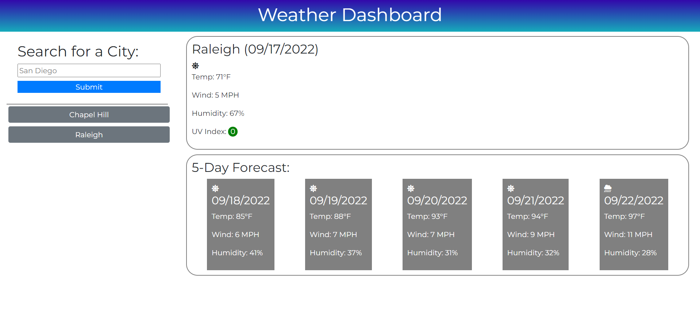

# ad-weather-dashboard

## Description
A weather dashboard that runs in the browser and features dynamically updated HTML and CSS, utilizing the OpenWeather One Call API to retrieve weather data for cities. When a city is searched, the application displays current weather conditions and a five-day forecast.

## Built With
- HTML
- CSS
- JavaScript
- OpenWeather API

## Screenshot

## Deployed Application
https://dashley2.github.io/ad-weather-dashboard/

## Questions
Please direct any questions to a.darrmedia@gmail.com. To see more projects, visit the link below for dashley2's respository:
- [GitHub Repository](https://github.com/dashley2)